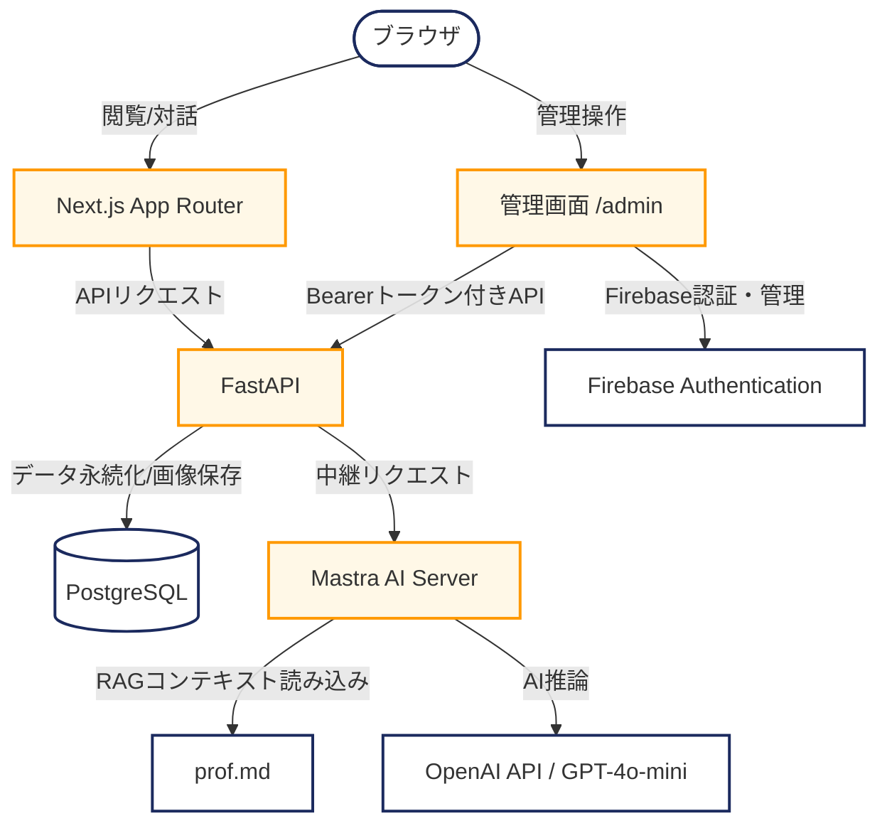

# 🎟️ 認証機能付きポートフォリオサイト (松本 麻由子)

Next.js, FastAPI, Mastra (AI Agent), PostgreSQL を使用した、フルスタックでモダンなモノレポ構成のポートフォリオサイトです。
ビジュアルには Y2K チケット風のデザインシステムを独自に組み込み、遊び心と実用性を兼ね備えた体験を提供します。

---

## 🏗️ システムアーキテクチャ

本プロジェクトは Docker Compose を用いて各コンポーネントを独立させて動かしており、実務におけるマイクロサービスやモノレポ開発に近い設計思想で構築されています。



---

## ⚡ 技術スタック

| レイヤー | 使用技術 / ライブラリ | 役割・選定理由 |
| :--- | :--- | :--- |
| **フロントエンド** | Next.js 15 (App Router), TypeScript, TailwindCSS v4 | 高速なレンダリングと、コンポーネントの再利用性に優れた UI 構築のため。 |
| **バックエンド** | Python 3.12, FastAPI, SQLAlchemy, Alembic | 高いパフォーマンスを持つ非同期 API 設計と、堅牢なスキーマ定義のため。 |
| **AI エージェント** | Mastra 1.18, OpenAI SDK, Node.js | エージェント型のワークフローを容易にし、自己紹介ファイルを動的にインプットするため。 |
| **データベース** | PostgreSQL 16 | トランザクションの信頼性、バイナリ画像データの保持のため。 |
| **認証・認可** | Firebase Authentication, Firebase Admin SDK | セキュアなログインと、特定の管理者 UID に基づくエンドポイント保護のため。 |
| **インフラ** | Docker, Docker Compose | 開発環境および将来的な AWS (EC2) 本番デプロイ時の一貫性維持のため。 |

---

## 🌟 主な機能

### 1. Y2Kチケット風トップページ
*   プロフィール、スキル、制作実績、お問い合わせフォームをシームレスに配置。
*   チケットの更新日時（`updated_at`）から自動でシリアルナンバー（`No. YYYY-MMDD`）を生成する遊び心溢れる設計。

### 2. 専属AIギャルアシスタント「こゅまちゃむ」 (チャットボット)
*   Mastra AI を活用した対話型チャットウィジェットを右下に搭載。
*   ルート直下の `prof.md`（自己紹介シート）を同期的にマウントして読み込むため、内容を更新するだけで AI がリアルタイムに新しい情報を覚えます。
*   「松本麻由子（まゆこむ）」を全力で推す、関西ギャル風の明るい口調で自己紹介や経歴をアピールします。

### 3. セキュアなコンテンツ管理画面 (`/admin`)
*   **Firebase 認証 ＆ 404ガード**：未認証のユーザーが `/admin` に直接アクセスしようとすると、存在自体を隠蔽するため `404 Not Found` を応答します。
*   **管理者認可チェック (UID検証)**：バックエンド側で `ADMIN_UIDS` 環境変数に登録された Firebase UID のみを許可する認可チェックを実装（登録者以外の書き換えを完全にブロック）。
*   **Partial Update (部分更新)**：プロフィール、実績、スキルの各情報を個別に編集可能。必要な項目のみを上書きし、省略された項目は既存のDBの値を維持します。
*   **画像データのDB保存 ＆ プレビュー**：アバターや実績の画像データをPostgreSQL内にバイナリとして保存。アップロード時は瞬時にプレビューが表示されます。

---

## 📂 ディレクトリ構造

```
.
├── backend/                  # FastAPI バックエンド
│   ├── src/
│   │   ├── main.py           # アプリ初期化、CORS設定、各ルーターの合流
│   │   ├── routers/          # 【分割モジュール】機能別のAPIRouter定義
│   │   │   ├── images.py     # 画像アップロード・取得
│   │   │   ├── profile.py    # プロフィール取得・更新
│   │   │   ├── achievements.py # 実績 CRUD
│   │   │   ├── skills.py       # スキル CRUD
│   │   │   ├── inquiries.py    # お問い合わせ送信
│   │   │   └── chat.py         # Mastra AIチャット中継
│   │   ├── crud.py           # データベース操作（Partial Update実装）
│   │   ├── schemas.py        # Pydantic スキーマ
│   │   ├── models.py         # SQLAlchemy モデル定義
│   │   └── firebase_auth.py  # Firebase Token / UID 検証モジュール
│   └── pyproject.toml        # 依存パッケージ管理 (uv)
│
├── frontend/                 # Next.js フロントエンド
│   ├── src/
│   │   ├── app/
│   │   │   ├── admin/        # 管理画面（_components でタブごとにモジュール化）
│   │   │   └── login/        # ログイン画面
│   │   ├── components/       # 共通 UI・各セクションコンポーネント
│   │   ├── hooks/            # カスタムフック (useChat, useAdminApi など)
│   │   └── services/         # API クライアント (api.ts)
│
├── mastra/                   # AI エージェントサーバー
│   └── src/mastra/agents/    # エージェント定義（prof.md 読み込み・口調プロンプト）
│
├── prof.md                   # AIが読み込む自己紹介データ（ここを編集すればOK）
└── docker-compose.yml        # Docker コンテナ定義
```

---

## 🛠️ ローカルセットアップ ＆ 起動手順

### 1. 環境変数の準備
プロジェクトのルートディレクトリに `.env` ファイルを作成し、以下の項目を設定します。

```env
# OpenAI / Gemini API
OPENAI_API_KEY=your_openai_api_key
GEMINI_API_KEY=your_gemini_api_key

# Firebase Configuration (フロントエンド用)
NEXT_PUBLIC_FIREBASE_API_KEY=your_firebase_api_key
NEXT_PUBLIC_FIREBASE_AUTH_DOMAIN=your_firebase_auth_domain
NEXT_PUBLIC_FIREBASE_PROJECT_ID=your_firebase_project_id
NEXT_PUBLIC_FIREBASE_STORAGE_BUCKET=your_firebase_storage_bucket
NEXT_PUBLIC_FIREBASE_MESSAGING_SENDER_ID=your_firebase_messaging_sender_id
NEXT_PUBLIC_FIREBASE_APP_ID=your_firebase_app_id

# Firebase Configuration (バックエンド認証用)
FIREBASE_PROJECT_ID=your_firebase_project_id

# 管理者として書き込みを許可する Firebase UID (カンマ区切りで複数指定可能)
ADMIN_UIDS=your_firebase_user_uid
```

### 2. 開発環境の起動（1コマンドセットアップ）
以下の起動スクリプトを実行するだけで、コンテナのビルド・起動、データベースのマイグレーション、および初期データ（プロフィール・実績・スキルの画像を含む）の投入がすべて自動で実行されます。

```bash
# 起動スクリプトの実行
./start.sh
```

### 4. 動作確認
ブラウザで以下のURLを開いて確認します。
*   フロントエンド (ポートフォリオ): `http://localhost:3000`
*   管理画面ログイン: `http://localhost:3000/login`
*   バックエンド API ドキュメント (Swagger UI): `http://localhost:8000/docs`
*   Mastra Studio (AIデバッグ): `http://localhost:5678`

---

## 💡 AIの自己紹介データ (prof.md) を更新した場合の反映手順

AIエージェント「こゅまちゃむ」が読み込む自己紹介シート（ルート直下の `prof.md`）を書き換えた際は、以下の手順で AI サーバーに新しいデータを読み込ませてください。

1. **Mastra コンテナの再起動**
   Mastra サーバーは起動時に `prof.md` を一度だけロードしてメモリに保持するため、ファイルを更新した後はコンテナを再起動して再ロードを行います。
   ```bash
   docker compose restart mastra
   ```

2. **チャットの対話履歴をリセット**
   ブラウザのチャット画面右上にある **「リセット」** ボタンをクリックして会話ログを消去することで、古い前提知識に引っ張られることなく、新しいプロフィールに基づいた回答が開始されます。
